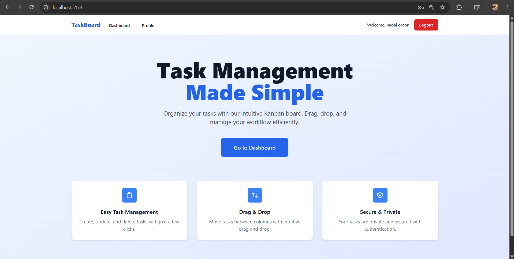
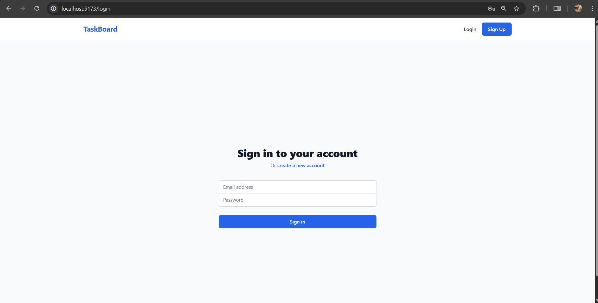
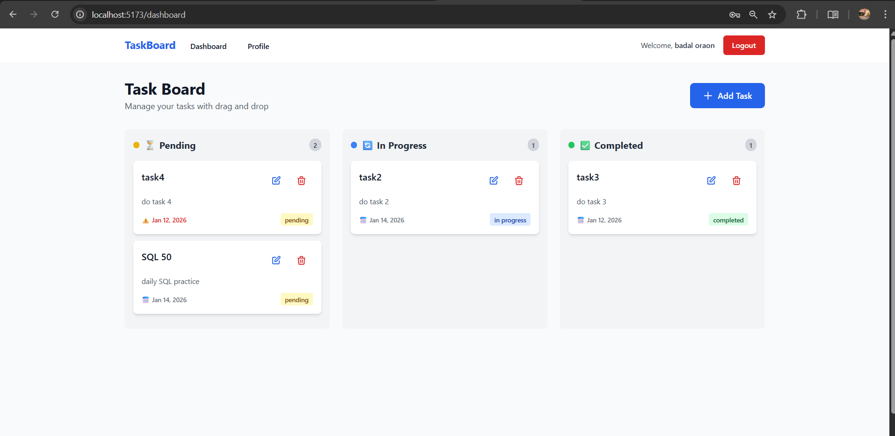
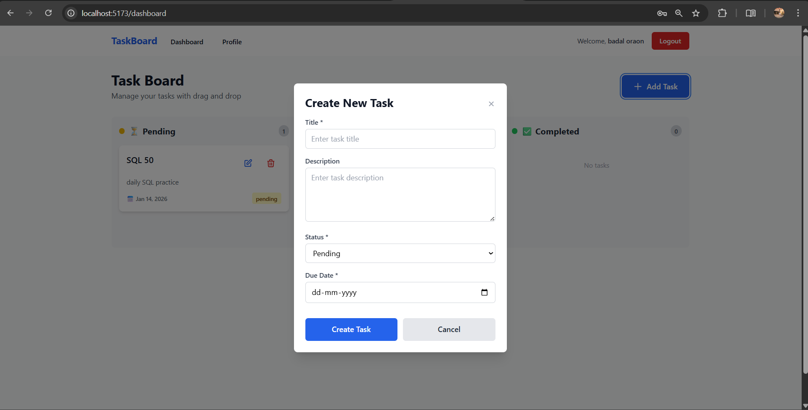
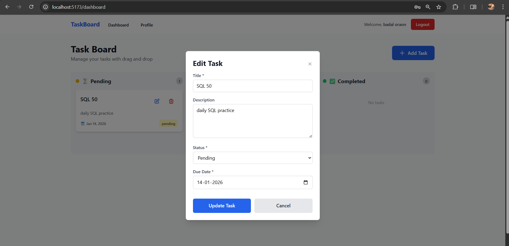

# Task Management System

A full-stack Kanban-based Task Management System with user authentication and drag-and-drop functionality.

**Author**: Badal Oraon  
**Roll Number**: BTECH/10738/22

## 🚀 Tech Stack

### Backend

- **Runtime**: Node.js
- **Framework**: Express.js
- **Database**: MongoDB with Mongoose
- **Authentication**: JWT (JSON Web Tokens)
- **Password Hashing**: bcryptjs
- **Validation**: express-validator

### Frontend

- **Framework**: React 18
- **Build Tool**: Vite
- **Styling**: Tailwind CSS
- **Routing**: React Router DOM
- **HTTP Client**: Axios
- **Drag & Drop**: @dnd-kit

## ✨ Features

- ✅ User authentication (Sign up, Login, Logout)
- ✅ User profile management (Update, Delete)
- ✅ Full CRUD operations for tasks
- ✅ Kanban board with three columns (Pending, In Progress, Completed)
- ✅ Drag and drop tasks between columns
- ✅ Filter tasks by status
- ✅ JWT-based protected routes
- ✅ Mobile responsive design
- ✅ Input validation and error handling

## 📁 Project Structure

```
badaloraon_BTECH_10738_22/
├── backend/                    # Backend API
│   ├── src/
│   │   ├── config/            # Database configuration
│   │   ├── controllers/       # Route controllers
│   │   ├── middleware/        # Custom middleware
│   │   ├── models/            # Database models
│   │   ├── routes/            # API routes
│   │   ├── utils/             # Utility functions
│   │   └── server.js          # Entry point
│   ├── tests/                 # Test files
│   ├── .env                   # Environment variables
│   ├── .env.example           # Example env file
│   ├── package.json
│   └── README.md
├── frontend/                   # Frontend application
│   ├── src/
│   │   ├── components/        # Reusable components
│   │   ├── pages/             # Page components
│   │   ├── context/           # React context
│   │   ├── services/          # API services
│   │   ├── utils/             # Utility functions
│   │   ├── App.jsx
│   │   └── main.jsx
│   ├── public/                # Static assets
│   ├── .env                   # Environment variables
│   ├── .env.example           # Example env file
│   ├── package.json
│   └── README.md
├── .gitignore
├── PROJECT_PLAN.md
└── README.md                   # This file
```

## 🔧 Setup Instructions

### Prerequisites

- Node.js (v14 or higher)
- MongoDB (local installation or MongoDB Atlas account)
- Git

### 1. Clone the Repository

```bash
git clone <repository-url>
cd badaloraon_BTECH_10738_22
```

### 2. Backend Setup

```bash
# Navigate to backend directory
cd backend

# Install dependencies
npm install

# Create .env file
cp .env.example .env

# Update .env with your configuration
# MONGODB_URI=mongodb://localhost:27017/task_management
# JWT_SECRET=your_secure_jwt_secret_key
# PORT=5000
# CLIENT_URL=http://localhost:5173

# Start the backend server (development mode)
npm run dev

# Or start in production mode
npm start
```

Backend will run on `http://localhost:5000`

### 3. Frontend Setup

```bash
# Navigate to frontend directory (from project root)
cd frontend

# Install dependencies
npm install

# Create .env file
cp .env.example .env

# Update .env with backend API URL
# VITE_API_URL=http://localhost:5000/api

# Start the frontend application
npm run dev

# Or build for production
npm run build
npm run preview
```

Frontend will run on `http://localhost:5173`

## 🔐 Environment Variables

### Backend (.env)

```env
PORT=5000
NODE_ENV=development
MONGODB_URI=mongodb://localhost:27017/task_management
JWT_SECRET=your_secure_jwt_secret_key
JWT_EXPIRE=7d
CLIENT_URL=http://localhost:5173
```

### Frontend (.env)

```env
VITE_API_URL=http://localhost:5000/api
```

## 📡 API Endpoints

### Authentication

- `POST /api/auth/signup` - Register new user
- `POST /api/auth/login` - Login user
- `POST /api/auth/logout` - Logout user (Protected)

### User Management

- `GET /api/users/profile` - Get user profile (Protected)
- `PUT /api/users/profile` - Update user profile (Protected)
- `DELETE /api/users/profile` - Delete user account (Protected)

### Task Management

- `POST /api/tasks` - Create new task (Protected)
- `GET /api/tasks` - Get all user tasks (Protected)
- `GET /api/tasks?status=pending` - Filter tasks by status (Protected)
- `GET /api/tasks/:id` - Get single task (Protected)
- `PUT /api/tasks/:id` - Update task (Protected)
- `DELETE /api/tasks/:id` - Delete task (Protected)

## 🎨 Usage

1. **Sign Up**: Create a new account on the signup page
2. **Login**: Login with your credentials
3. **Dashboard**: View your Kanban board with tasks
4. **Create Task**: Click "Add Task" button to create a new task
5. **Drag & Drop**: Drag tasks between columns to update their status
6. **Edit/Delete**: Click on task cards to edit or delete them
7. **Profile**: Update your profile information
8. **Logout**: Logout from the application

## 📱 Responsive Design

The application is fully responsive and works seamlessly on:

- 📱 Mobile devices (320px+)
- 📱 Tablets (768px+)
- 💻 Desktop (1024px+)
- 🖥️ Large screens (1920px+)

## 📸 Screenshots

### Landing Page


_Landing page with features showcase and call-to-action buttons_

### Login Page


_User authentication interface with email and password_

### Dashboard - Kanban Board


_Drag and drop task management with three columns: Pending, In Progress, and Completed_

### Create Task


_Task creation interface with title, description, status, and due date_

### Edit Task


_Task editing interface for updating existing tasks_

## 🧪 Testing

```bash
# Backend tests (if implemented)
cd backend
npm test

# Frontend tests (if implemented)
cd frontend
npm test
```

## 🚀 Deployment

### Backend Deployment Options

- Render
- Railway
- Heroku
- AWS/Azure/GCP

### Frontend Deployment Options

- Vercel
- Netlify
- GitHub Pages

## 📝 Database Models

### User Model

```javascript
{
  username: String (unique, required),
  email: String (unique, required),
  password: String (hashed, required),
  createdAt: Date,
  updatedAt: Date
}
```

### Task Model

```javascript
{
  user: ObjectId (ref: User),
  title: String (required),
  description: String,
  status: String (enum: ['pending', 'in-progress', 'completed']),
  due_date: Date (required),
  createdAt: Date,
  updatedAt: Date
}
```

## 🔒 Security Features

- Password hashing with bcryptjs
- JWT-based authentication
- Protected API routes
- CORS configuration
- Input validation
- Error handling middleware

## 🐛 Known Issues

None at the moment. Please report any issues you encounter.

## 📄 License

ISC

## 👤 Author

**Badal Oraon**  
Roll Number: BTECH/10738/22

---

## 📞 Support

For any questions or issues, please create an issue in the repository.
